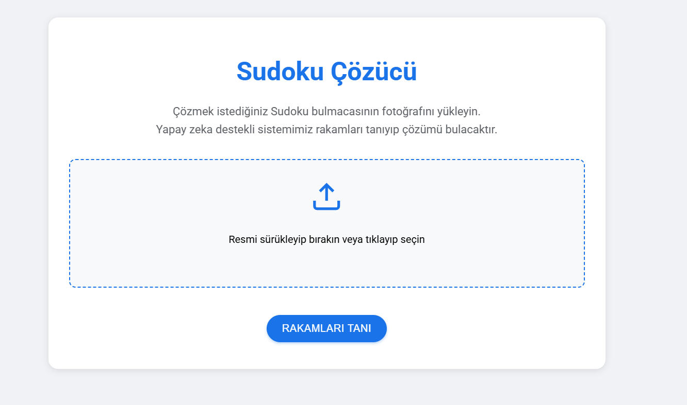
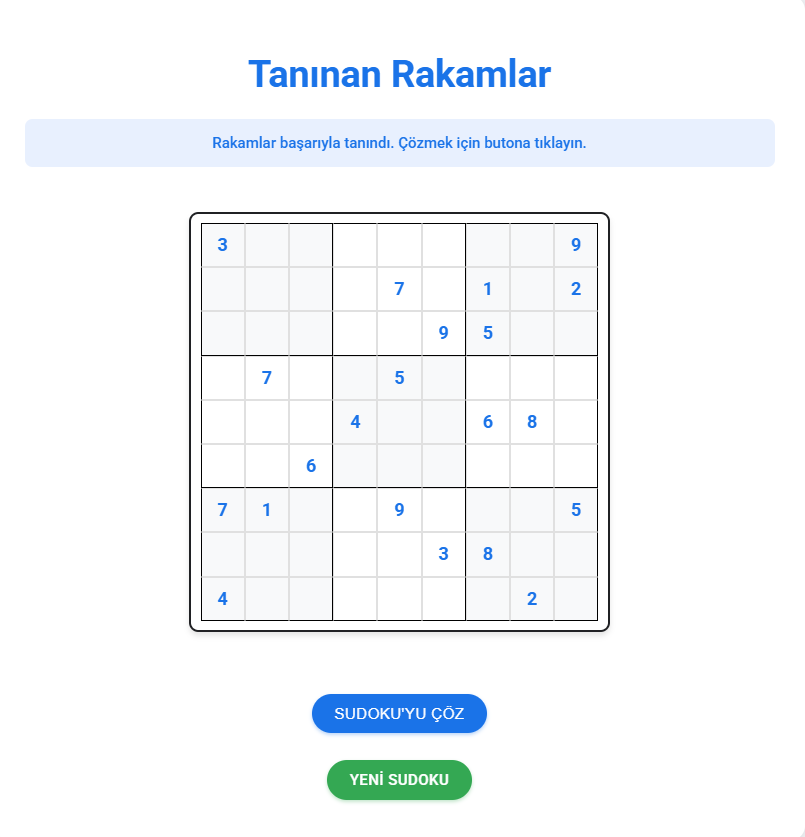
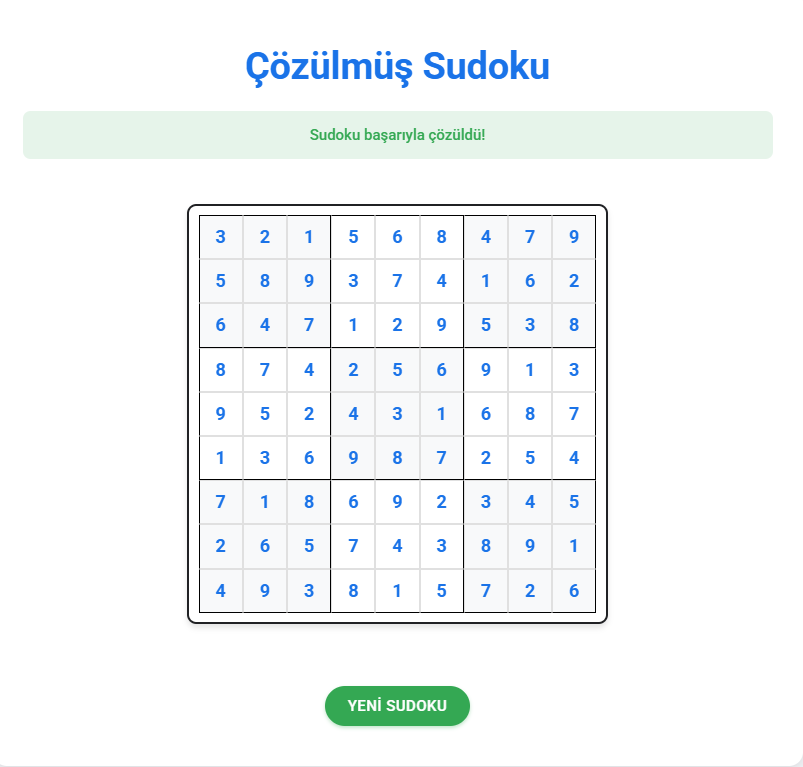

# 🧩 English | İngilizce

# 🧩 AI-Powered Sudoku Solver

A web application powered by artificial intelligence designed to solve Sudoku puzzles. The application automatically recognizes numbers from uploaded Sudoku images and provides solutions.

## 📸 Project Screenshots

### Homepage


### Sudoku Recognition


### Solution Result


## 🚀 Features

- 📸 Automatic number recognition from Sudoku photos
- 🤖 AI-powered image processing
- ⚡ Fast and efficient solving algorithm
- 🎨 Modern and user-friendly interface
- 📱 Mobile-responsive design
- 🖱️ Drag-and-drop file upload support

## 🛠️ Technologies

- **Backend:** Python, Flask
- **Frontend:** HTML5, CSS3, JavaScript
- **AI:** TensorFlow, OpenCV
- **Image Processing:** PIL (Python Imaging Library)

## ⚙️ Installation

1. Clone the repository:
```bash
git clone https://github.com/username/sudoku-solver.git
cd sudoku-solver
```

2. Create and activate virtual environment:
```bash
python -m venv venv
# For Windows
venv\Scripts\activate
# For Linux/Mac
source venv/bin/activate
```

3. Install required packages:
```bash
pip install -r requirements.txt
```

4. Run the application:
```bash
python app.py
```

5. Open in your browser: `http://localhost:5000`

## 📝 Usage

1. Upload a Sudoku photo to the "Drag and drop or click to select image" area on the homepage
2. Click "Recognize Numbers"
3. Check the recognized numbers
4. Click "Solve Sudoku" to view the solution

## 📋 Requirements

- Python 3.8 or higher
- Flask 2.0.1
- TensorFlow 2.5.0
- OpenCV 4.5.3
- NumPy 1.19.5
- Pillow 8.3.1

## 🤝 Contributing

1. Fork this repository
2. Create a new branch (`git checkout -b feature/newFeature`)
3. Commit your changes (`git commit -am 'New feature: Description'`)
4. Push to the branch (`git push origin feature/newFeature`)
5. Create a Pull Request


---
⭐ Don't forget to star this project if you liked it!

---

# 🧩 Turkish | Türkçe

# 🧩 Yapay Zeka Destekli Sudoku Çözücü

Sudoku bulmacalarını çözmek için geliştirilmiş, yapay zeka destekli bir web uygulaması. Uygulama, yüklenen Sudoku görüntüsündeki rakamları tanıyarak otomatik çözüm sunar.

## 📸 Proje Resimleri

### Ana Sayfa


### Sudoku Tanıma


### Çözüm Sonucu


## 🚀 Özellikler

- 📸 Sudoku fotoğrafından otomatik rakam tanıma
- 🤖 Yapay zeka destekli görüntü işleme
- ⚡ Hızlı ve etkili çözüm algoritması
- 🎨 Modern ve kullanıcı dostu arayüz
- 📱 Mobil uyumlu tasarım
- 🖱️ Sürükle-bırak dosya yükleme desteği

## 🛠️ Teknolojiler

- **Backend:** Python, Flask
- **Frontend:** HTML5, CSS3, JavaScript
- **Yapay Zeka:** TensorFlow, OpenCV
- **Görüntü İşleme:** PIL (Python Imaging Library)

## ⚙️ Kurulum

1. Repoyu klonlayın:
```bash
git clone https://github.com/kullaniciadi/sudoku-solver.git
cd sudoku-solver
```

2. Sanal ortam oluşturun ve aktifleştirin:
```bash
python -m venv venv
# Windows için
venv\Scripts\activate
# Linux/Mac için
source venv/bin/activate
```

3. Gerekli paketleri yükleyin:
```bash
pip install -r requirements.txt
```

4. Uygulamayı çalıştırın:
```bash
python app.py
```

5. Tarayıcınızda şu adresi açın: `http://localhost:5000`

## 📝 Kullanım

1. Ana sayfada "Resmi sürükleyip bırakın veya tıklayıp seçin" alanına Sudoku fotoğrafını yükleyin
2. "Rakamları Tanı" butonuna tıklayın
3. Tanınan rakamları kontrol edin
4. "Sudoku'yu Çöz" butonuna tıklayarak çözümü görüntüleyin

## 📋 Gereksinimler

- Python 3.8 veya üzeri
- Flask 2.0.1
- TensorFlow 2.5.0
- OpenCV 4.5.3
- NumPy 1.19.5
- Pillow 8.3.1


---
⭐ Bu projeyi beğendiyseniz yıldız vermeyi unutmayın! 